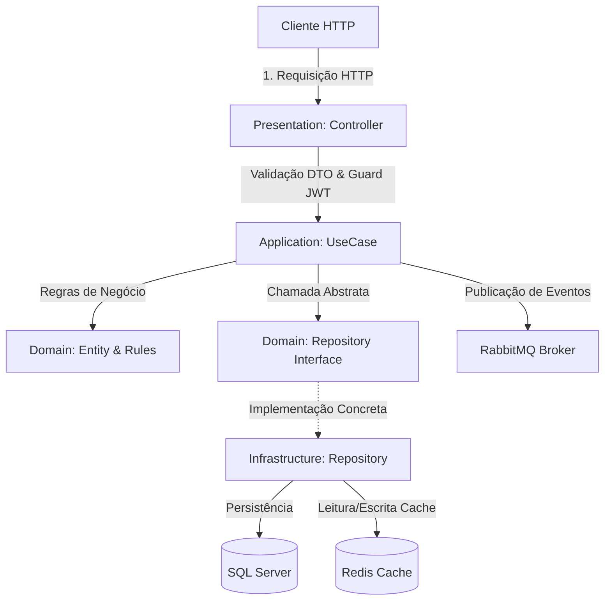

# Fluxo de Arquitetura e Funcionamento do Sistema

Este documento descreve detalhadamente como as requisições são processadas na API do Sistema de Gestão de Frotas, desde o recebimento do estímulo HTTP no Controller até a persistência no banco de dados, o gerenciamento de cache no Redis e a publicação de eventos no RabbitMQ.

---

## 1. Visão Geral da Arquitetura (Clean Architecture)

O projeto segue os princípios da **Clean Architecture**, dividindo cada módulo do domínio (`auth`, `users`, `brands`, `models`, `vehicles`) em quatro camadas distintas:

1. **Domain (Domínio)**: Contém as entidades ricas de negócio, as interfaces dos repositórios (abstrações) e erros específicos do domínio. Não possui dependências externas.
2. **Application (Aplicação)**: Contém as regras de negócio em casos de uso (`UseCases`) e a definição de DTOs (`Data Transfer Objects`) com validações.
3. **Infrastructure (Infraestrutura)**: Contém detalhes técnicos como mapeamento do TypeORM (entidades ORM), implementações concretas dos repositórios, integrações com Redis e RabbitMQ.
4. **Presentation (Apresentação)**: Contém os controladores NestJS (`Controllers`) que recebem as requisições HTTP e devolvem respostas estruturadas.



---

## 2. Ciclo de Vida Completo de uma Requisição

Para ilustrar o funcionamento, utilizaremos como exemplo a rota de **Criação de Veículo (`POST /vehicles`)**.

### Etapa 1: Apresentação (Controller)
1. O cliente faz uma requisição HTTP `POST /vehicles` com o payload do veículo.
2. A requisição passa pelo `JwtAuthGuard` global, que valida o token JWT contido no header `Authorization`.
3. O NestJS executa o `ValidationPipe` global. Ele valida o payload contra a classe `CreateVehicleDto` (usando `class-validator` e `class-transformer` para sanitizar e tipar as entradas). Se houver dados inválidos, retorna `400 Bad Request` imediatamente.
4. O `VehicleController` recebe os dados validados no DTO e o usuário autenticado e invoca o caso de uso `CreateVehicleUseCase`.

### Etapa 2: Regra de Negócio (Use Case)
1. O `CreateVehicleUseCase` (injetado via Dependency Injection) executa o método `execute()`.
2. O caso de uso executa validações de domínio necessárias (ex: verifica se o modelo do veículo existe através do `IModelRepository` e se a placa, chassi ou renavam já estão cadastrados).
3. Caso alguma regra de negócio seja violada (ex: placa duplicada), o caso de uso lança uma exceção de domínio (ex: `VehicleAlreadyExistsError`).
4. Se tudo estiver correto, cria a entidade de domínio `Vehicle` e chama o `IVehicleRepository.create()`.

### Etapa 3: Persistência & Cache (Repository & Cache)
1. A implementação concreta `TypeOrmVehicleRepository` (na camada de Infraestrutura) recebe a entidade de domínio, mapeia para a entidade ORM (`VehicleOrmEntity`) e persiste no **SQL Server** usando a transação ou EntityManager do TypeORM.
2. Como um novo veículo foi criado, o cache de listas de veículos torna-se obsoleto. O repositório ou o caso de uso sinaliza a invalidação do cache utilizando o `ICacheProvider` (Redis).
   - As chaves de cache correspondentes (como `vehicles:list:*`) são apagadas (`DEL`) para forçar uma nova consulta ao banco na próxima requisição de leitura.

### Etapa 4: Eventos de Integração (RabbitMQ)
1. Após persistir com sucesso no banco de dados e invalidar o cache, o caso de uso publica o evento `vehicle.created` na fila apropriada do **RabbitMQ**.
2. Essa publicação é feita de forma assíncrona, permitindo que outros microsserviços (como faturamento, auditoria ou rastreamento) processem a criação do veículo de forma desacoplada.

### Etapa 5: Resposta HTTP
1. O controlador recebe o resultado do caso de uso e envelopa no formato padrão de sucesso:
   ```json
   {
     "data": {
       "id": "uuid-do-veiculo",
       "licensePlate": "AIV-1010",
       ...
     }
   }
   ```
2. Caso tenha ocorrido alguma exceção no fluxo, o `AllExceptionsFilter` global intercepta o erro, formata-o de acordo com o padrão e retorna o status HTTP adequado (ex: `409 Conflict` para erros de concorrência/duplicidade, `404 Not Found` para entidades ausentes).

---

## 3. Estratégia de Caching com Redis

O cache é aplicado nas operações de leitura de dados frequentes e invalidado nas operações de escrita correspondentes para garantir a consistência eventual:

| Operação | Comportamento do Cache | Chaves Afetadas |
|---|---|---|
| **Listar Veículos (`GET /vehicles`)** | **Cache Aside**: Tenta ler do Redis. Se não encontrar (cache miss), busca do banco de dados SQL Server, salva no Redis com TTL configurado e retorna. | `vehicles:list` |
| **Buscar Veículo (`GET /vehicles/:id`)** | **Cache Aside**: Tenta ler a entidade do Redis por ID. Se não encontrar, busca do banco de dados, salva no Redis e retorna. | `vehicles:id:<id>` |
| **Criar/Editar/Excluir Veículo** | **Write-Through Invalidation**: Realiza a escrita no SQL Server e apaga as chaves de lista e de ID correspondentes do Redis. | Deleta `vehicles:list` e `vehicles:id:<id>` |

---

## 4. Tratamento Global de Erros

Todas as exceções do sistema são unificadas pelo `AllExceptionsFilter`.
- **Exceções de Domínio** (que herdam de `DomainError`, como `VehicleNotFoundError` ou `UnauthorizedUserError`) são mapeadas automaticamente para os códigos de status HTTP corretos (404, 409, 401, etc.).
- **Erros inesperados** do sistema são mascarados para o cliente (retornando `500 Internal Server Error`) para evitar vazamento de dados de infraestrutura, mas são devidamente gravados com stack traces completos nos logs estruturados.

---

## 5. Como rodar o fluxo localmente

Você pode interagir e inspecionar todo esse ciclo de vida das requisições utilizando os arquivos de teste incluídos:
1. Levante a infraestrutura completa com `docker-compose up --build`.
2. Abra o arquivo [api.http](file:///c:/meus-projetos/info-sistema-teste-tecnico-backend/api.http) e envie as requisições sequencialmente usando a extensão **REST Client** do VS Code.
3. Acompanhe os logs estruturados no terminal do contêiner `fleet_api`.
