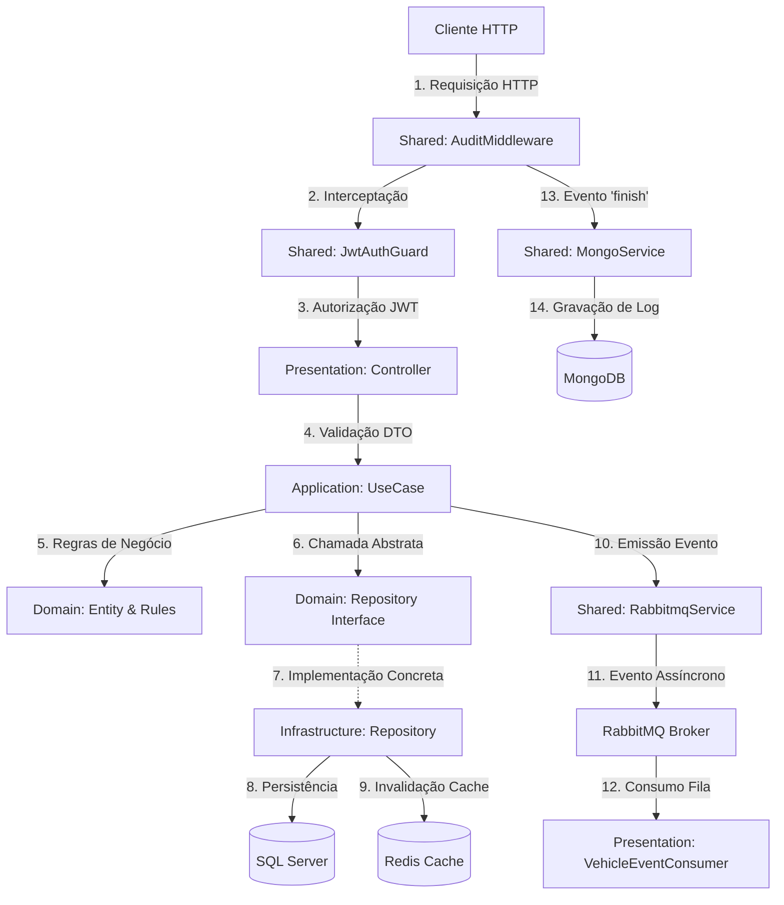

# Fluxo de Arquitetura e Funcionamento do Sistema

Este documento descreve detalhadamente como as requisições são processadas na API do Sistema de Gestão de Frotas, desde o recebimento do estímulo HTTP no Controller até a persistência no banco de dados, o gerenciamento de cache no Redis, a auditoria em MongoDB e a publicação de eventos no RabbitMQ.

---

## 1. Visão Geral da Arquitetura (Clean Architecture)

O projeto segue os princípios da **Clean Architecture**, dividindo cada módulo do domínio (`auth`, `users`, `brands`, `models`, `vehicles`) em quatro camadas distintas:

1. **Domain (Domínio)**: Contém as entidades ricas de negócio, as interfaces dos repositórios (abstrações) e erros específicos do domínio. Não possui dependências externas.
2. **Application (Aplicação)**: Contém as regras de negócio em casos de uso (`UseCases`) e a definição de DTOs (`Data Transfer Objects`) com validações.
3. **Infrastructure (Infraestrutura)**: Contém detalhes técnicos como mapeamento do TypeORM (entidades ORM), implementações concretas dos repositórios, e conexões/provedores de serviços externos (Redis, RabbitMQ, MongoDB).
4. **Presentation (Apresentação)**: Contém os controladores NestJS (`Controllers`), Guards de segurança, Filtros de exceção e Consumidores de mensageria.

---

## 2. Para Desenvolvedores de Outras Linguagens: O que é o NestJS?

Se você vem do **Spring Boot (Java)**, **ASP.NET Core (C#)**, **FastAPI (Python)** ou **Go (Gin/Fiber)**, aqui está como os conceitos do NestJS se traduzem:

- **Módulos (`@Module`)**: Funcionam como contêineres de injeção de dependência locais (similares a pacotes configurados do Spring ou assemblies/namespaces configurados no ASP.NET). Um módulo agrupa controladores, serviços e exporta o que outros módulos podem usar.
- **Controladores (`@Controller`)**: Equivalem aos Controllers no Spring (`@RestController`) ou ASP.NET (`[ApiController]`). Eles expõem endpoints HTTP, definem verbos (GET, POST, etc.) e mapeiam dados de entrada.
- **Provedores / Serviços (`@Injectable`)**: Classes de negócio ou infraestrutura gerenciadas pelo contêiner de Injeção de Dependência (DI). Equivalem a Beans do Spring ou Serviços Registrados no contêiner do ASP.NET.
- **Guards (`@UseGuards`)**: Semelhante a filtros de autorização ou middlewares de segurança. Eles interceptam a requisição antes de atingir o controlador para verificar papéis ou tokens (como JWT).
- **Middlewares (`NestMiddleware`)**: Semelhantes aos Middlewares do Express, ASP.NET Core ou Django. Eles executam antes dos Guards e são ideais para logs globais, manipulação de headers ou rastreamento.
- **Pipes (`ValidationPipe`)**: Funcionam como o Model Binding do ASP.NET Core ou validadores do Spring. Eles transformam os dados brutos e validam contra as regras declaradas no DTO usando bibliotecas como `class-validator` (semelhante a anotações `@NotNull`, `@Min` do Bean Validation).
- **Filtros de Exceção (`@Catch`)**: Equivalentes a Middleware de Tratamento de Erros Global ou `@ControllerAdvice` do Spring. Interceptam erros lançados na aplicação e geram uma resposta HTTP padronizada.

---

## 3. Configuração Centralizada de Ambiente (`@nestjs/config`)

Para evitar referências diretas e espalhadas ao `process.env` (variáveis de ambiente globais do Node.js), a aplicação centraliza todas as configurações em um único local:

1. **`src/config/configuration.ts`**:
   - Este arquivo inicializa uma instância do `ConfigService` do NestJS e centraliza todas as variáveis em um objeto estruturado e tipado.
   - Fornece valores padrão seguros para o ambiente de desenvolvimento.
2. **Registro no `AppModule`**:
   - O `ConfigModule.forRoot({ isGlobal: true, load: [configuration] })` carrega e torna essas configurações disponíveis em toda a aplicação.
3. **Uso via Injeção**:
   - Os serviços injetam o `ConfigService` e recuperam as variáveis de forma segura e padronizada (ex: `this.configService.get<string>('mongo.uri')`).
4. **Resolução de Decoradores Estáticos**:
   - Para trechos de código executados antes da inicialização completa do contêiner de injeção (como decoradores `@Module` dinâmicos ou CLI de banco de dados), a função de configuração é chamada diretamente (`configuration().databaseProvider`), respeitando o princípio DRY.

---

## 4. Ciclo de Vida Completo de uma Requisição (Com Auditoria e Eventos)

Para ilustrar o fluxo ponta a ponta, veja o ciclo de vida completo do endpoint **Criar Veículo (`POST /vehicles`)**:

### Etapa 1: Middleware de Entrada
1. O cliente envia uma requisição HTTP `POST /vehicles`.
2. A requisição bate no **`AuditMiddleware`** global. O middleware clona os dados recebidos (corpo, query e parâmetros de rota) e adiciona um ouvinte para o evento `'finish'` do objeto de resposta do Express (`res.on('finish', ...)`).
3. O fluxo da requisição continua normalmente.

### Etapa 2: Guarda de Autenticação e Validação
1. A requisição atinge o **`JwtAuthGuard`** (Guard). Ele extrai o token JWT do header `Authorization`, valida-o e anexa os dados decodificados do usuário ao objeto da requisição em `req.user`.
2. Em seguida, o **`ValidationPipe`** executa a validação do DTO `CreateVehicleDto`. Se houver erros de formato, lança um erro HTTP 400.

### Etapa 3: Execução da Regra de Negócio (Controller e Use Case)
1. O **`VehicleController`** recebe o DTO e invoca o caso de uso **`CreateVehicleUseCase`**.
2. O **`CreateVehicleUseCase`** executa a lógica de negócios (por exemplo, valida placa, chassi e renavam contra duplicidade usando repositórios abstratos).
3. Havendo sucesso, cria a entidade rica de domínio `Vehicle` e invoca o método de criação do repositório `IVehicleRepository`.

### Etapa 4: Persistência e Invalidação de Cache
1. O repositório concreto (**`TypeOrmVehicleRepository`** ou **`InMemoryVehicleRepository`**) persiste o registro no banco de dados.
2. O caso de uso então invoca o `ICacheProvider` (Redis) para invalidar chaves de cache correspondentes (ex: limpa o prefixo `vehicles:` para forçar uma listagem atualizada na próxima consulta).

### Etapa 5: Emissão de Eventos de Integração (RabbitMQ)
1. Com a transação no banco concluída, o caso de uso chama o **`RabbitmqService`** para disparar o evento `vehicle.created`.
2. O `RabbitmqService` emite o evento para o broker RabbitMQ de forma assíncrona (`emitSafe`).
3. **Resiliência**: Se o RabbitMQ estiver offline, o erro é registrado no log do console, mas o fluxo HTTP do cliente NÃO é bloqueado, garantindo alta disponibilidade (fail-safe).
4. O evento cai na fila `vehicles_queue` e é consumido pelo **`VehicleEventConsumer`** no mesmo projeto (ou em outros serviços), disparando os fluxos paralelos.

### Etapa 6: Finalização e Escrita do Log de Auditoria (MongoDB)
1. O controlador retorna o status `201 Created` com a entidade criada.
2. A resposta é enviada ao cliente. Neste momento, o evento `'finish'` da resposta Express é acionado.
3. O **`AuditMiddleware`** recupera as informações finais:
   - Status Code retornado (`201` ou código de erro).
   - Usuário autenticado (`req.user` anexado pelo Guard de JWT).
   - Payload higienizado (as chaves `password`, `token`, `jwt` e `secret` são convertidas para `***REDACTED***`).
4. O middleware chama o **`MongoService`** para persistir esse registro na coleção `audit_logs` no MongoDB.
5. **Resiliência**: Se o MongoDB estiver fora do ar, o erro é capturado e registrado no console, e o cliente não é impactado.

---

## 5. Estratégia de Cache e Consistência (Redis)

O cache é aplicado nas operações de leitura de dados frequentes e invalidado nas operações de escrita correspondentes para garantir a consistência eventual:

| Rota | Tipo | Comportamento do Cache | Chaves Afetadas |
|---|---|---|---|
| **`GET /vehicles`** | Leitura | **Cache Aside**: Tenta ler do Redis (`vehicles:list`). Em caso de *cache miss*, busca do banco SQL, grava no Redis com o TTL definido (padrão: 1h) e retorna. | `vehicles:list` |
| **`GET /vehicles/:id`** | Leitura | **Cache Aside**: Tenta ler do Redis (`vehicles:id:<id>`). Em caso de falha, busca do banco de dados, grava no Redis e retorna. | `vehicles:id:<id>` |
| **`POST /vehicles`** | Escrita | **Write-Through Invalidation**: Persiste o novo veículo no banco de dados e apaga todas as chaves de cache que comecem com `vehicles:` no Redis. | Invalida todas as chaves com prefixo `vehicles:` |
| **`PATCH /vehicles/:id`** | Escrita | **Write-Through Invalidation**: Modifica os dados no banco SQL Server e invalida o cache com prefixo `vehicles:`. | Invalida todas as chaves com prefixo `vehicles:` |
| **`DELETE /vehicles/:id`** | Escrita | **Write-Through Invalidation**: Exclui o veículo do banco e invalida o cache correspondente. | Invalida todas as chaves com prefixo `vehicles:` |

---

## 6. Tratamento Global de Erros

A aplicação utiliza o **`AllExceptionsFilter`** global para gerenciar erros:
1. **Erros de Domínio**: Erros conhecidos herdados de `DomainError` (ex: `VehicleNotFoundError`, `ModelNotFoundError`, `VehicleAlreadyExistsError`) são traduzidos para respostas HTTP estruturadas com códigos apropriados (404 Not Found, 409 Conflict, 400 Bad Request).
2. **Erros de Validação**: Disparados automaticamente pelo `ValidationPipe` quando os dados da requisição falham contra as regras declaradas no DTO. Retorna HTTP 400.
3. **Erros Inesperados**: Exceções não tratadas (ex: falhas de conexão de banco de dados relacional SQL Server) retornam uma mensagem genérica de `500 Internal Server Error` para o cliente (evitando exposição de informações internas), mas registram a stack trace completa no console para investigação.

---

## 7. Ciclo de Vida e Eventos Internos (Lifecycle Hooks)

O NestJS gerencia todo o ciclo de vida dos componentes que ele cria (como serviços, controladores e módulos). Para permitir a execução de códigos em momentos chave desse ciclo (como abrir conexões ao iniciar a aplicação ou fechar recursos ao desligar), o framework disponibiliza interfaces conhecidas como **Lifecycle Hooks**.

No projeto, utilizamos principalmente:

### 1. `OnModuleInit` (Método `onModuleInit()`)
- **Quando ocorre?** Executado assim que o módulo contendo o serviço é inicializado e todas as suas dependências internas foram resolvidas e injetadas.
- **Para que serve?** É o local ideal para inicializar conexões assíncronas externas (como bancos de dados ou cache) e rodar seeds iniciais.
- **Equivalentes**:
  - **Spring Boot**: Método anotado com `@PostConstruct`.
  - **ASP.NET Core**: Fase de inicialização de um `IHostedService` (`StartAsync`).
- **Exemplos no Projeto**:
  - **`MongoService`**: Estabelece conexão com o MongoDB na inicialização da aplicação.
  - **`RedisCacheProvider`**: Conecta o cliente do Redis.
  - **`DatabaseSeedService`** e **`FleetStoreService`**: Rodam a carga inicial (seed) do usuário administrativo no banco.

### 2. `OnModuleDestroy` (Método `onModuleDestroy()`)
- **Quando ocorre?** Executado imediatamente antes do encerramento completo da aplicação NestJS (durante o encerramento do contêiner DI).
- **Para que serve?** Garante o encerramento limpo (graceful shutdown) de conexões, prevenindo vazamentos de recursos (memory leaks) e conexões zumbis nos servidores.
- **Equivalentes**:
  - **Spring Boot**: Método anotado com `@PreDestroy`.
  - **ASP.NET Core**: Método `Dispose()` ou `StopAsync` de serviços hospedados.
- **Exemplos no Projeto**:
  - **`MongoService`**: Executa `client.close()` para fechar a conexão ativa com o MongoDB.
  - **`RedisCacheProvider`**: Executa `client.quit()` para desconectar de forma segura do Redis.

